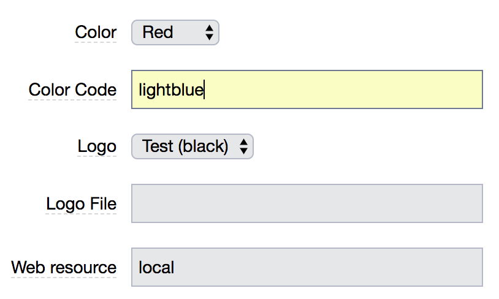
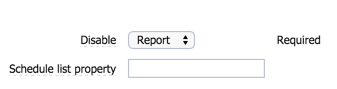
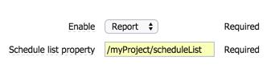

<h1>EC-Admin</h1>

EC-Admin is a collection of administrative procedures to help you
manage your server. Its inception was sparked by requests from customers
during my Professional Services engagements. It has grown over the years to
what it is now.

In June 2018, the plugin has been converted to the
  <a href="https://github.com/electric-cloud/PluginWizard">PluginWizard DSL</a>
  format to the whole plugin code is managed by the SCM without the need to
  extract the project first. 
As a side effect the promotion of the plugin can take a couple of minutes as
the DSL code as to be evaluated on the server.

Requirements:

<ul>
  <li>Electric Flow 6.0 minimum</li>
  <li>EC-PluginManager 1.4.0</li>
</ul>

<h2>Installation</h2>

This collection of procedures can be found on our
<a href="https://github.com/electric-cloud/EC-Admin">GitHub
repository</a>. It is available as a plugin delivered
in the form of a .jar file or you can simply get the source code
and build it yourself.

To install the plugin, use one the following methods:

<ul>
<li>the "Install from File/URL" tab in the administration/Plugins</li>
<li>the Perl "$ec->installPlugin()" API.</li>
<li> the CLI client "ectool installPlugin --force 1 EC-Admin.jar</li>
</ul>

Don't forget to promote the plugin after installation. Now the plugin has
  been converted to PluginWizard and DSL format, the promotion takes a little
  longer. You have to increase to DSL timeout setting to at least 180 (3 minutes).

To install on 4.0.x or or 4.1.x, import the EC_4.0.xml file. Be
aware that some features are not present as the original project
makes use of createJobStep() API which was introduced in 4.2.0: 
ectool import /path_to/EC-Admin_for_EC_4.0.xml --disableSchedules 1

<h2>Building</h2>

To build the plugin, you will need to have first to build
  <a href="https://github.com/electric-cloud/ecpluginbuilder">ecpluginbuilder</a>
  for your platform. 

  Then simply:
  <ul>
    <li>log into your Flow server with "ectool --server SERVER login USER PWD"</li>
    <li>run "ec-perl ecpluginbuilder.pl", the tool will:
      <ul>
        <li>increment the build counter (main version can be changed in the script or with the -version option)</li>
        <li>build the plugin</li>
        <li>install the plugin</li>
        <li>promote the plugin</li>
      </ul>  
    </li>
    </ul>

<h2>Content</h2>

It contains the following modules:

<ul>
<li><a href="#health">System Health</a></li>
<ul>
<li>testResources</li>
</ul>

<li><a href="#look">Look and Feel</a></li>
<ul>
<li>changeBannerColor</li>
</ul>

<li><a href="#jobs">Jobs and Workspaces management</a></li>
<ul>
<li>jobsCleanup</li>
<li>jobsCleanup_byResult</li>
<li>deleteWorkspaceOrphans</li>
<li>deleteObjects</li>
</ul>

<li><a href="#plugin">Plugins</a></li>
<ul>
<li>synchronizePlugins</li>
</ul>

<li><a href="#artifacts">Artifacts management</a></li>
<ul>
<li>artifactRepositorySynchronization</li>
<li>artifactsCleanup</li>
<li>artifactsCleanup_byQuantity</li>
</ul>

<li><a href="#backup">Object export backup and restore</a></li>
<ul>
<li>saveProjects</li>
<li>saveAllObjects</li>
<li>restoreObjects</li>
</ul>

<li><a href="#schedules">Schedules</a></li>
<ul>
<li>schedulesDisable</li>
<li>schedulesEnable</li>
</ul>

<li><a href="#semaphore">Semaphore management</a></li>
<ul>
<li>acquireSemaphore</li>
<li>releaseSemaphore</li>
</ul>

<li><a href="#license">License Logger</a></li>
<li><a href="#postp">postp debugger helper</a></li>
<li><a href="#comm">Communication</a></li>
<li><a href="#misc">miscellaneous</a></li>
<ul>
<li>findJobId</li>
</ul>

</ul>

<h2>Installation</h2>

This collection of procedures can be found on our
<a href="https://github.com/electric-cloud/EC-Admin">GitHub
repository</a>. It is available as a plugin delivered
in the form of a .jar file or you can simply get the source code
and recompile it yourself.

To install the plugin, use one the following methods:

<ul>
<li>the "Install from File/URL" tab in the administration/Plugins</li>
<li>the Perl "$ec->installPlugin()" API.</li>
<li> the CLI client "ectool installPlugin --force 1 EC-Admin.jar</li>
</ul>

Don't forget to promote the plugin after installation.

To install on 4.0.x or or 4.1.x, import the EC_4.0.xml file. Be
aware that some features are not present as the original project
makes use of createJobStep() API which was introduced in 4.2.0: 
ectool import /path_to/EC-Admin_for_EC_4.0.xml --disableSchedules 1

IMPORTANT: For all parameter descriptions below, required
parameters are shown in bold italics.

<h1>System Health</h1>

<h2>testResources</h2>

This procedure is simply to test connection to all your resources or a
specific pool. This will create simple step to run an echo command on
alive resources.

<table class="grid">
<thead>
<tr><th>Parameter</th><th>Description</th></tr>
</thead>
<tbody>
<tr>
<td>pool</td>
<td>Name of a pool. If empty, all resources will be tested</td>
</tr>
</tbody>
</table>

<h1>Look and Feel</h1>
<h2>changeBannerColor</h2>

If you work on multiple Commander servers like a development and a
production instances, this procedure is for you. It allows you to change the color of the top banner and the logo to make it easier to identify your different servers. Feel free
to <a href="mailto:lrochette@electric-cloud.com">send me</a> new ones if you have a more artistic touch than me. Or better
push your changes to
<a href="https://github.com/electriccommunity/EC-Admin">GitHub</a>.

<table class="grid">
<thead>
<tr><th>Parameter</th><th>Description</th></tr>
</thead>
<tbody>
<tr>
<td class='required'>color</td>
<td>Choose a color for your top banner</td>
</tr>
<tr>
<td>logo</td>
<td>Choose a set of pre-rendered logo to indicate
if you server is of type DEV, SDK, TEST or PROD, in black or white to
go along different background colors.</td>
</tr>
<tr>
<td>logoFile</td>
<td>The path on the Commander server to upload your own logo. If this value is not blank it will overwritten the logo parameter above.</td>
</tr>
<tr>
<td>webResource</td>
<td>The name of the resource running on your web server to allow the copy of the logo and banner color files.</td>
</tr>
</tbody>
</table>

<b>Note:</b> if you run your server and agent as different user (as recommended), the agent won't be able to modify the following files:

<ul>
<li>INSTALL_DIR/apache/htdocs/commander/images/logo.gif</li>
<li>INSTALL_DIR/apache/htdocs/flow/public/app/assets/img/logo.png</li>
<li>INSTALL_DIR/apache/htdocs/commander/styles/StdFrame.css</li>
<li>INSTALL_DIR/apache/htdocs/flow/public/app/assets/css/main.css</li>
</ul>

Those file permissions need to be opened so the agent user can modify them.

will produce

<h1>Jobs and Workspaces management</h1>

This set of procedures will help you manage your old jobs and the
associated workspaces.

<h2>jobsCleanup:</h2>

A procedure to delete jobs older than a specified number of
days. It will also delete associated workspace job directories.

<table class="grid">
<thead>
<tr><th>Parameter</th><th>Description</th></tr>
</thead>
<tbody>
<tr>
<td class='required'>olderThan</td>
<td>Indicate the number of days after which jobs are deleted</td>
</tr>
<tr>
<td class='required'>jobType</td>
<td>Define what jobs should be deleted: Error, Warning or all.</td>
</tr>
<tr>
<td>jobProperty</td>
<td>Name of a property attached to your jobs. If this property is set, your job won't be deleted no matter how old it is.</td>
</tr>
<tr>
<td>jobPatternMatching</td>
<td>A SQL pattern matching to automatically preserve some jobs. The pattern must solve for a LIKE statement.</td>
</tr>
<tr>
<td class='required'>delete</td>
<td>If this option is not set, only report is done. No real data are deleted</td>
</tr>
<tr>
<td class='required'>computeUsage</td>
<td>Check off to skip the computation of the number of steps and the file space used for the job. This will speed up the execution.</td>
</tr>
</tbody>
</table>

<h2>jobCleanup_byResult:</h2>

A procedure to delete jobs older than a specified number of days.
It will also delete associated workspace job directories. It will keep the
number of successful, failed and warning jobs you entered. You can also
provide a property name, if this property is attached to the job, it won't be
deleted no matter how old. A report only mode prevents any real deletion.

<h2>deleteWorksapceOrphans:</h2>

A procedure to crawl a workspace directory to find orphan jobs
(directories without a matching job) on a specified resource.

<h2>deleteObjects:</h2>

A procedure to quickly delete jobs or workflows older than a
specified number of days. It will <b>not</b> delete associated workspace job
directories. This is for customers with huge job or workflow database.

<h1>Plugins</h1>
<h2>Plugin Synchronization</h2>

This procedure synchronizes plugins between the server and
a resource. Plugins are uploaded first as artifacts if it has not been
done already and then downloaded on the resource if it does not
already exist in the plugins directory.

<h1>Artifact Management</h1>

<h2>artifactRepositorySynchronization</h2>

Synchronize the content of a source artifact repositories to a target
one. You can use pattern matching to select specific artifact
versions to synchronize.

<table class="grid">
<thead><tr><th>Parameter</th><th>Description</th></tr></thead>
<tbody>
<tr>
<td class='required'>Source Artifact Repository</td>
<td>The name of the artifact repository from which to synchronize.</td>
</tr>
<tr>
<td class='required'>Target Artifact Repository</td>
<td>The name of the artifact repository to which to synchronize.</td>
</tr>
<tr>
<td class='required'>Synchronization Resource</td>
<td>The name of a resource used as a buffer to download/upload the files.</td>
</tr>
<tr>
<td>Artifact Version Pattern</td>
<td>Pattern of artifact version to sync. Examples: 
MyGrp:MyKey:* (all artifact versions with group MyGrp and key MyKey), 
MyGrp:* (all artifact versions with group MyGrp), 
* (all artifact versions. This is the default).</td>
</tr>
<tr>
<td>Batch Size</td>
<td>Number of artifact version to process at once. A high number
could overwhelm your gateways.</td>
</tr>
</tbody>
</table>

<h2>artifactsCleanup</h2>

A procedure to delete artifact versions older than a specified number
of days. Same as for jobs above, a property allows preventing the deletion. Once the
artifacts have been deleted, artifact repositories and artifact caches are
cleaned as well (deleting stale artifacts).  A report mode prevents any
real deletion.

<h2>artifactsCleanup_byQuantity</h2>

As "ArtifactsCleanup"", this procedure deletes artifact versions
older than a specified number
of days but keeps only X per Artifact. Again, a property allows preventing the
deletion. Once the
artifacts have been deleted, artifact repositories and artifact caches are
cleaned as well (deleting stale artifacts).  A report only mode prevents any
real deletion.

<h1>Object export and backup</h1>

This set of procedures is to help you export objects from
ElectricCommander for a potential inclusion into your SCM for
versioning.

<h2>saveProjects</h2>

This procedure simply exports your projects in a directory on the
server. It is recommended to enable the nightly schedule associated
with it to backup your projects on a regular basis.

<h2>saveAllObjects</h2>

This procedure brings a finer granularity to a full server export.
For  example, it may be easier to retrieve a simple project or procedure
instead of the full server export or database backup to undo r a wrong action
or a bad code change. By  default it exports projects and each procedure
individually. In addition by  enabling the matching checkboxes, you can also
export resources,  resource pools, workspaces, users and groups, and with 5.x
and later ElectricFlow Deploy objects (Applications, Components and
Environments). It is recommended to enable the nightly schedule associated
with it to backup your projects on a regular basis.

<b>Note:</b> Use saveProjects or saveAllObjects depending on the
granularity you are requiring.

<h2>restoreObjects</h2>

This procedure allows you to import all the .xml files in a directory.
Typically those have been created with saveAllObjects above.

<table class="grid">
<thead><tr><th>Parameter</th><th>Description</th></tr></thead>
<tbody>
<tr>
<td class='required'>directory</td>
<td>The directory where the .xml files are located.</td>
</tr>
<tr>
<td>force</td>
<td>A boolean to pass the --force 1 option to import.</td>
</tr>
<tr>
<td>resource</td>
<td>The resource on which to read the files.</td>
</tr>
</tbody>
</table>

<h1>Schedules</h1>

This set of procedures is to help around schedule enabling and disabling which is very useful when you want to perform maintenance on your server.

<h2>schedulesDisable</h2>

This procedure disables all the enabled schedules and optionally saves the list in a property.

<table class="grid">
<thead><tr><th>Parameter</th><th>Description</th></tr></thead>
<tbody>
<tr>
<td class='required'>Disable</td>
<td>If this option is not set, only report is done. No schedules are disabled.</td>
</tr>
<tr>
<td>Schedule list property</td>
<td>Property path used by the step to save the list of schedules disabled. Can be used by schedulesEnable.</td>
</tr>
</tbody>
</table>

<h2>schedulesEnable</h2>

This procedure enables schedules passed as a list in a property, typically saved by schedulesDisable.

<table class="grid">
<thead><tr><th>Parameter</th><th>Description</th></tr></thead>
<tbody>
<tr>
<td class='required'>Enable</td>
<td>If this option is not set, only report is done. No schedules are enabled.</td>
</tr>
<tr>
<td class='required'>Schedule list property</td>
<td>Property path containing the list of disabled schedules.</td>
</tr>
</tbody>
</table>

<h1>Semaphore Management</h1>

<h2>acquireSemaphore and releaseSemaphore:</h2>

Those 2 procedures are used to create a "semaphore" to control the access to
a set of steps. In order to insure the atomicity (only one step can modify
your semaphore property at any time) of the operation, you first need to create
a resource with a 1-step limit. 
Then you will need to create a property with a value of 0. The location
does not matter
as long as it will be readable and writable by the plugin.

<h2>acquireSemaphore</h2>

This procedure is the "gate". It checks than you have not used more
tokens than allowed. If you have, it will simply wait until some become
available. This procedure is called just before the steps which access
you want to control.

<table class="grid">
<thead><tr><th>Parameter</th><th>Description</th></tr></thead>
<tbody>
<tr>
<td class='required'>maxSemaphoreValue</td>
<td>This is the maximum number of token you allow for this semaphore.</td>
</tr>
<tr>
<td class='required'>semaphoreProperty</td>
<td>Property path containing your gate current value.</td>
</tr>
<tr>
<td class='required'>serializationResource</td>
<td>The name of the 1-step resource to access the semaphore property.</td>
</tr>
</tbody>
</table>

<h2>releaseSemaphore</h2>

This procedure simply "releases" of of the token for other to consume.

<table class="grid">
<thead><tr><th>Parameter</th><th>Description</th></tr></thead>
<tbody>
<tr>
<td class='required'>semaphoreProperty</td>
<td>Property path containing your gate current value.</td>
</tr>
<tr>
<td class='required'>serializationResource</td>
<td>The name of the 1-step resource to access the semaphore property.</td>
</tr>
</tbody>
</table>

<h1>License Logger</h1>

The License Logger mechanism is intended to collect and email various
license-related statistics. It is implemented as a set of schedules and procedures,
along with a set of configuration properties.

The configuration properties are located under /server/EC-Admin/licenseLogger/config.
The property sheet is created upon promotion if it does not already exists.The following
properties can be set up:

<table class="grid">
<thead><tr><th>Parameter</th><th>Description</th></tr></thead>
<tbody>
<tr>
<td>resource</td>
<td>The name of the resource on which to run the procedures. Default is "local".</td>
</tr>
<tr>
<td>workspace</td>
<td>The name of the workspace used by the procedures. Default is "default".</td>
</tr>
<tr>
<td>cleanOldJobs</td>
<td>A boolean to remove old jobs so only the last one is kept for each procedure. It keeps your job history cleaner.</td>
</tr>
<tr>
<td class='required'>emailConfig</td>
<td>The name of the mail configuration used to send report.</td>
</tr>
<tr>
<td class='required'>emailTo</td>
<td>The list of recipients (semicolon separated) to which to send the reports.</td>
</tr>
</tbody>
</table>

<h1>postp debugger helper</h1>

The debugPostp is a simple procedure to help you debug with postp. Traditionally you would call postp from the command line with the jobStepId of the faulty postp and adding some additional option to see details. This new procedure does that for you on Linux and Windows, you just have to pass the jobStepId as a parameter.

<h1>Communication</h1>

The sendAlert is a simple procedure to send a message to all registered users with an email address attached to the account. You can format your email in HTML by encapsulating it in a &lt;html&gt; tag.

<h1>Miscellaneous</h1>

For all those procedure I'm not sure where to put

<h2>findJobId</h2>

This procedure is designed for people migrating away from ElectricCommander
4.2 to ElectricFlow 5.x or later. It will simply search in the step commands
or parameters to a sub-procedure for any instance of jobId. No change will
be done. It's up to the user to make any change.

<table class="grid">
<thead><tr><th>Parameter</th><th>Description</th></tr></thead>
<tbody>
<tr>
<td>projectPattern</td>
<td>A SQL pattern to filter projects for the search.</td>
</tr>
</tbody>
</table>

<h1>Contact authors</h1>
<dl>
<dt>License Logger</dt>
<dd>Mike Westerhof</dd>

<dt>deleteObjects</dt>
<dt>testResources</dt>
<dd><a href="https://github.com/tanaynagjee">Tanay Nagjee</a></dd>

<dt>Other</dt>
<dd>Laurent Rochette (<a href="mailto:lrochette@electric-cloud.com">lrochette@electric-cloud.com</a>)</dd>
</dl>

<h1>Legal Jumbo</h1>

This module is free for use. Modify it however you see fit to better your
experience using ElectricFlow. Share your enhancements and fixes.

This module is not officially supported by Electric Cloud. It has undergone no
formal testing and you may run into issues that have not been uncovered in the
limited semi automatic and manual testing done so far.

Electric Cloud should not be held liable for any repercussions of using this
software.

